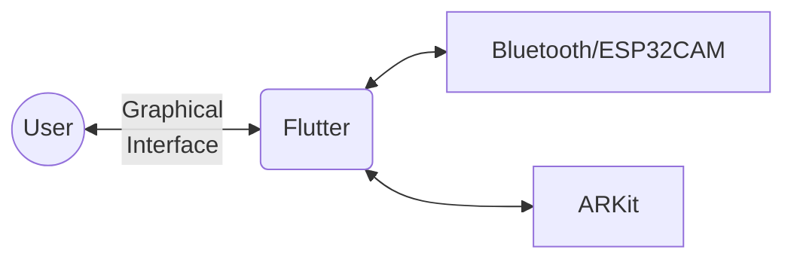

# Setting up the Software

## Application design overview

The application runs on [Flutter](https://flutter.dev), a framework for creating beautiful and native mobile, web, and desktop applications.

The application interface is shown to the user. When he/she draws via the iOS device the flutter app processes the data and then sends the extrapolated coordinates to the ESP by bluetooth using the `flutter_blue_plus` library. The face, eyes and mouth movements are detected using [ARKit](https://developer.apple.com/augmented-reality/) advanced facial tracking capabilities.




## In-depth explanation of the flutter code

The code for the app is designed as follows :
- It instantiates a stateful widget called FaceCanvasPage that represents a page in the Flutter app.

- The FaceCanvasPage widget manages the ARKit scene and UI elements related to face tracking and drawing.

- It initializes and configures the ARKitController for face tracking.

- It sets up listeners and handlers for adding and updating face anchors (a face anchor represents a face) in the ARKit scene.

- It defines a custom painter (PointerPainter) that paints a red pointer on the screen based on the detected face's position and orientation.

- The PointerPainter class calculates the effective coordinates for the pointer based on the face's position and applies a moving average algorithm to smooth the pointer's movement.

- The PointerPainter class also notifies the UI about the pointer's position by updating a ValueNotifier object called drawingData.

- The FaceCanvasPage widget builds the User Interface for the face tracking page. The UI elements are arranged in a Stack widget and displayed on the screen.
- Various state variables and methods are defined within the FaceCanvasPage widget to manage the state of the app, handle user interactions(such as eye-blinking, opening the mouth, etc) and update the UI.

The code for the bluetooth communication between ESP and flutter app is pretty straight-forward : 
- create characteristics and pin them
- handle connecting and disconnecting
- write functions for setting the coordinates and lower/raise the pen to start/stop drawing
- call these functions at the right time and place

How it works precisely is well explained in the library's documentation ([see here](https://pub.dev/packages/flutter_blue_plus))

### Difficulties encountered 
The main challenge for the flutter app was to find a way to smoothen the drawings, because it was extremely shaky at first, even while holding your head still the pointer would still move around in a jerky way. Many (many) possible solutions where tried but they weren't good enough, until finally the moving average technique showed very satisfying results. We used the `moving_average` library and implemented it in our own way (not using all of its aspects), resulting in two arrays storing previous x and y coordinates and fetching them to compute an average position to set the next point.

Other things that took time were included setting up the bluetooth communication (a good understanding was needed), understanding how to use eye-blinking features, or handle the ARKit face anchors.

## Preparing the development environment
:::note
Unfortunately, a macOS device and an iOS device with a TrueDepth sensor camera are currently needed to run the app.
:::

1. Begin by installing [Xcode](https://developer.apple.com/xcode).
2. Download and install the [Flutter SDK](https://docs.flutter.dev/get-started/install/macos) as well as [CocoaPods](https://cocoapods.org/). You may find it easier to do so using [Homebrew](https://brew.sh) (respective packages [here](https://formulae.brew.sh/cask/flutter#default) and [here](https://formulae.brew.sh/formula/cocoapods#default)).
3. Make sure everything works by opening a terminal and running
    ```bash
    flutter doctor
    ```
    You should see checkmarks for at least the two following categories.
    
    ```
    [✓] Flutter (Channel stable…)
    …
    [✓] Xcode - develop for iOS and macOS (Xcode 14.3)
    ```
    If this is not the case then retry the steps above or make sure none were skipped.
4. Clone the FaceDoodle repository:
    ```shell
    git clone git@gitlab.epfl.ch:facedoodle/facedoodle-app
    ```
    
5. From the repository folder, open `ios/Runner.xcworkspace` with Xcode. This can be done quickly with 
    ```bash
    open ios/Runner.xcworkspace
    ```
    
6. Select **Runner** from the project navigator:

    
    
    Then under "Signing", choose a team for the the application. If none exists, you will need to add an Apple account using the Add Account button.
    
    
    
    
    Then build the project by choosing **Product > Build** from the menu bar. 
    
You should now be ready to go!


## Running the app

1. Connect an iOS device to your computer.
2. Make sure your iOS device is in developer mode (See [this page](https://developer.apple.com/documentation/xcode/enabling-developer-mode-on-a-device))
3. On your flutter project, open a terminal and type 
    ``` 
    flutter run
    ````

4. On the first run, it's very likely the iPad complains about not trusting the developer. If that is the case, go to **Settings > General > VPN and Device Management**, and click **Trust** on the developer app.


There you go! The app should start automatically on your iOS device.
 